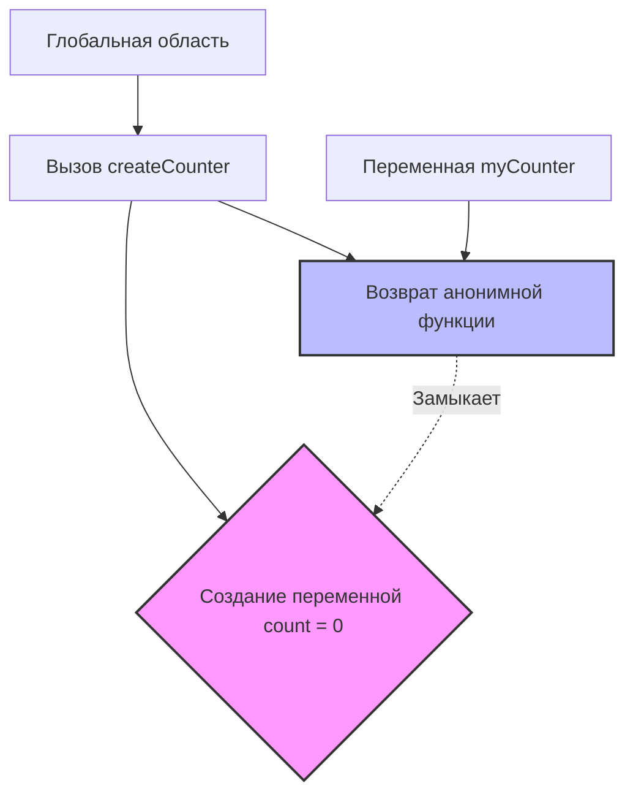

# Deep Dive: Сложные концепции JavaScript

В этом документе мы разберем две самые запутанные темы в JavaScript: **Замыкания (Closures)** и контекст **`this`**, используя методику глубокого погружения.

---

## Тема 1: Замыкания (Closures)

### 1. Аналогия: Рюкзак путешественника
Представьте, что функция — это путешественник. Когда путешественник (функция) отправляется в путь (выполняется), он берет с собой рюкзак.

В этот рюкзак он кладет все вещи (переменные), которые были вокруг него в момент, когда он **собирался** (создавался). Даже если путешественник улетит в другую страну (будет вызван в другом месте кода), он все равно сможет достать вещи из своего рюкзака.

**Замыкание — это функция + её рюкзак с переменными.**

### 2. Техническое объяснение
Замыкание позволяет функции запоминать и иметь доступ к переменным из внешней области видимости, даже когда эта внешняя функция уже завершила выполнение.

**Проблема:** Как создать приватную переменную (например, счетчик), которую нельзя изменить снаружи напрямую, но можно менять через специальную функцию?

```javascript
function createCounter() {
    let count = 0; // Эта переменная спрятана внутри "рюкзака"

    return function() {
        count++; // Внутренняя функция имеет доступ к count
        return count;
    };
}

const myCounter = createCounter();
console.log(myCounter()); // 1
console.log(myCounter()); // 2
```

### 3. Визуализация (Mental Model)



Когда `createCounter` завершается, переменная `count` **не удаляется** из памяти, потому что возвращаемая функция держит на неё ссылку ("рюкзак").

### 4. Разбор "Магии"
1.  `const myCounter = createCounter()`: Запускается `createCounter`. Создается `count = 0`. Возвращается функция. `createCounter` умирает, но `count` остается жива в замыкании.
2.  `myCounter()` (1-й раз): Функция лезет в свой "рюкзак", видит `count` (0), увеличивает до 1, возвращает 1.
3.  `myCounter()` (2-й раз): Функция снова лезет в ТОТ ЖЕ рюкзак. Там уже лежит 1. Увеличивает до 2.

### 5. Ловушки и Грабли
**Ошибка:** Создание функций в цикле.

```javascript
// ПЛОХО
for (var i = 0; i < 3; i++) {
    setTimeout(function() {
        console.log(i); // Выведет 3, 3, 3
    }, 100);
}
```
*Почему:* `var` имеет функциональную область видимости, а не блочную. Все таймеры ссылаются на одну и ту же переменную `i`, которая в конце цикла равна 3.

**Исправление:** Использовать `let` (блочная область видимости) — для каждой итерации создается свой "рюкзак".

```javascript
// ХОРОШО
for (let i = 0; i < 3; i++) {
    setTimeout(function() {
        console.log(i); // Выведет 0, 1, 2
    }, 100);
}
```

### 6. Интерактивное упражнение
Что выведет этот код и почему?

```javascript
function secret() {
    let key = 123;
    return {
        getKey: () => key,
        setKey: (newKey) => key = newKey
    };
}

const box1 = secret();
const box2 = secret();

box1.setKey(555);
console.log(box2.getKey()); // ???
```
*(Ответ: 123. Потому что `box1` и `box2` — это два разных вызова `secret`, у каждого свой собственный "рюкзак" с переменной `key`.)*

---

## Тема 2: Контекст `this`

### 1. Аналогия: Местоимение "Я"
Слово `this` в JavaScript работает точно так же, как слово "Я" в русском языке.

*   Если "Я" говорит **Иван**, оно означает Ивана.
*   Если "Я" говорит **Мария**, оно означает Марию.
*   Смысл слова "Я" зависит от того, **КТО** его произносит прямо сейчас.

В JS: `this` — это ссылка на объект, который **вызывает** функцию в данный момент.

### 2. Техническое объяснение
`this` позволяет методам работать с данными своего объекта, не зная заранее имя переменной этого объекта.

```javascript
const user = {
    name: "Alex",
    sayHi() {
        console.log("Привет, " + this.name);
    }
};

user.sayHi(); // "Привет, Alex" (this = user)
```

### 3. Визуализация (Правило точки)
Самый простой способ понять, чему равен `this` — посмотреть на то, что стоит **слева от точки** при вызове.

*   `obj.method()` -> `this` = `obj`
*   `db.users.getItem()` -> `this` = `db.users`
*   `func()` (без точки) -> `this` = `window` (или `undefined` в строгом режиме)

### 4. Разбор "Магии" (Потеря контекста)
Частая проблема: передача метода как callback.

```javascript
const user = {
    name: "Alex",
    sayHi() { console.log(this.name); }
};

setTimeout(user.sayHi, 1000); // undefined!
```
*Почему:* Мы передали в `setTimeout` саму функцию `user.sayHi`, но оторвали её от объекта `user`. Через секунду `setTimeout` вызовет её просто как `func()`, без точки. `this` потеряется.

### 5. Ловушки и Грабли (Стрелочные функции)
Стрелочные функции `() => {}` **не имеют своего `this`**. Они берут `this` из того места, где были созданы (лексический контекст).

```javascript
const group = {
    title: "Developers",
    students: ["Alex", "Bob"],

    showList() {
        // Обычная функция здесь потеряла бы this
        this.students.forEach((student) => {
            // А стрелочная берет this из showList (то есть group)
            console.log(this.title + ": " + student);
        });
    }
};
group.showList(); // Работает!
```

### 6. Интерактивное упражнение
Чему будет равен `this.name` в каждом случае?

```javascript
const obj1 = { name: "Obj1", func: function() { return this.name; } };
const obj2 = { name: "Obj2" };

obj2.func = obj1.func; // Копируем ссылку на функцию

console.log(obj1.func()); // 1. ???
console.log(obj2.func()); // 2. ???
```
*(Ответ: 1. "Obj1", 2. "Obj2". Функция одна и та же, но вызывается от разных объектов. Правило точки решает.)*