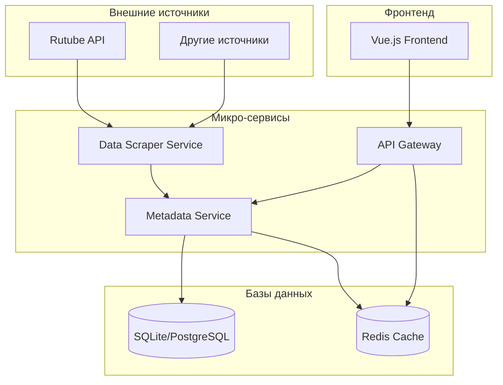

# Архитектура микро-сервисов для передачи данных фильмов на фронтенд

## Текущий анализ проекта

Проект уже имеет базовую структуру:
- **Backend**: FastAPI с SQLite и Redis
- **Frontend**: Vue.js с TypeScript
- **Существующие модели**: Item и User
- **Скрапер**: для сбора данных с Rutube

## Требования к системе

### Функциональные требования
- Передача метаданных фильмов на фронтенд
- Данные: название фильма, год выпуска, изображение, дата добавления, количество просмотров
- Без авторизации пользователей
- Поддержка пагинации и фильтрации

### Нефункциональные требования
- Высокая доступность
- Масштабируемость
- Производительность
- Простота поддержки

## Архитектура микро-сервисов

### Предлагаемая схема из 3 микро-сервисов:

1. **Data Scraper Service** - сбор данных с внешних источников
2. **Metadata Service** - управление метаданными фильмов
3. **API Gateway** - единая точка входа для фронтенда

### Схема данных для фильмов

```python
class Movie(Base):
    __tablename__ = "movies"
    
    id = Column(Integer, primary_key=True, index=True)
    title = Column(String, index=True)           # Название фильма
    year = Column(Integer)                       # Год выпуска
    image_url = Column(String)                   # URL изображения
    thumbnail_url = Column(String)               # URL миниатюры
    views = Column(Integer, default=0)           # Количество просмотров
    added_at = Column(DateTime, default=func.now()) # Дата добавления
    source_url = Column(String)                  # Исходный URL
    duration = Column(String)                    # Длительность
    description = Column(Text)                   # Описание
    genre = Column(String)                       # Жанр
    rating = Column(Float)                       # Рейтинг
    is_active = Column(Boolean, default=True)    # Активность
```

## Диаграмма взаимодействия сервисов



## Детальная архитектура

### 1. Data Scraper Service
- **Назначение**: Сбор данных с Rutube и других источников
- **Технологии**: Python, FastAPI, Selenium/BeautifulSoup
- **Функции**:
  - Периодический сбор данных
  - Обработка и нормализация данных
  - Отправка данных в Metadata Service

### 2. Metadata Service
- **Назначение**: Управление метаданными фильмов
- **Технологии**: Python, FastAPI, SQLAlchemy
- **Функции**:
  - CRUD операции с фильмами
  - Кэширование данных в Redis
  - Поиск и фильтрация
  - Пагинация

### 3. API Gateway
- **Назначение**: Единая точка входа для фронтенда
- **Технологии**: FastAPI
- **Функции**:
  - Маршрутизация запросов
  - Агрегация данных
  - Кэширование
  - Rate limiting

## План реализации

### Этап 1: Рефакторинг существующего кода
- Создание моделей данных для фильмов
- Обновление схем Pydantic
- Настройка миграций базы данных

### Этап 2: Разделение на микро-сервисы
- Выделение Data Scraper Service
- Создание Metadata Service
- Настройка API Gateway

### Этап 3: Интеграция и тестирование
- Настройка взаимодействия между сервисами
- Тестирование производительности
- Документация API

### Этап 4: Деплоймент
- Настройка Docker контейнеров
- Конфигурация оркестрации
- Мониторинг и логирование

## Преимущества предложенной архитектуры

1. **Масштабируемость**: Каждый сервис можно масштабировать независимо
2. **Отказоустойчивость**: Проблемы в одном сервисе не влияют на другие
3. **Гибкость**: Легко добавлять новые источники данных
4. **Производительность**: Кэширование и оптимизированные запросы
5. **Поддержка**: Проще поддерживать и развивать отдельные компоненты

## Следующие шаги

1. Утвердить архитектуру
2. Начать реализацию с рефакторинга моделей данных
3. Постепенно разделять функциональность на микро-сервисы
4. Тестировать взаимодействие между компонентами